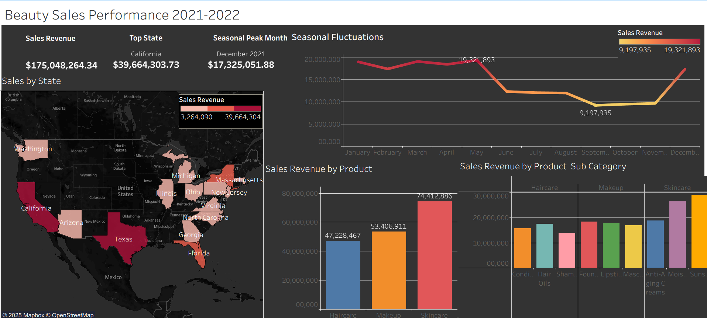

# Dave Williams — Data Portfolio

Welcome! I'm **Dave Williams**, a Data Analyst and Visual Storyteller specializing in:
- SQL troubleshooting, data cleaning, joins, filtering, and aggregation
- Tableau dashboards and narrative storytelling
- Clear documentation and annotated case studies

This portfolio showcases how I clean data, build insights, and communicate findings visually.

---

## Overview

A glimpse of my work—clean data, uncover insights, and tell compelling visual stories.

> Replace each image path with your actual files (recommended: store them in `images/overview/`).

|  |  |  |
|---|---|---|
|  |  |  |

> Tip: Use consistent dimensions for a neat grid (e.g., 1400px width sources; GitHub will scale them).

---

## Highlights

- End-to-end SQL case studies with annotated screenshots
- Interactive Tableau dashboards for exploration
- Modular, well-documented projects for easy review and reuse

---

## Project Index

| Project | Area | Tools | Highlights |
|---|---|---|---|
| [Support Ticket Analysis](sql-projects/support-ticket-analysis) | Operations | SQL, Tableau | Data cleaning, joins, aggregation, dashboard |
| [Hotel Operations Analysis](sql-projects/hotel-operations-analysis) | Hospitality | SQL | Filtering, joins, operational insights |
| [Grocery Sales Analysis](sql-projects/grocery-sales-analysis) | Retail | SQL | Cleaning, filtering, aggregation |
| [Motorcycle Sales Analysis](sql-projects/motorcycle-sales-analysis) | Retail | SQL | Net revenue calculation |
| [Fan Engagement Case Study](sql-projects/fan-engagement-case-study) | Sports | SQL | Joins, filtering, aggregation |
| [Customer Churn Analysis](tableau-projects/customer-churn-analysis) | Product | Tableau | Storytelling dashboard with churn drivers |
| [Support Ticket Dashboard](tableau-projects/support-ticket-dashboard) | Operations | Tableau | Interactive dashboard |
| [Beauty Industry Sales Analysis](tableau-projects/beauty-industry-sales-analysis) | Retail | Tableau | Sales trends visualization |
| [IPL Fan Survey Analysis](r-programming-projects/ipl-fan-survey-analysis) | Sports | R | Data visualization, data wrangling, ggplot2 |

> Tip: Each project folder includes a README with context, methods, visuals, and key takeaways.

---

## Skills

- SQL: Data cleaning, joins, filtering, aggregation, revenue calculations  
- Tableau: Dashboard design, storytelling, interactive actions  
- Documentation: Modular case studies, annotated visuals, teaching takeaways  

---

## How to Explore

1. Browse the Project Index above and click into a project of interest.  
2. Open the project README for context, methods, and visuals.  
3. Review scripts (SQL/R) and dashboards linked within each project.

---

## Links

- Tableau Public: [Profile](https://public.tableau.com/)  
- LinkedIn: [Dave Williams](https://www.linkedin.com/in/dave-williams-209a23252)

---

## Contact

- Email: dave.williams@example.com  
- Open to collaboration on analytics, dashboarding, and data storytelling projects.

