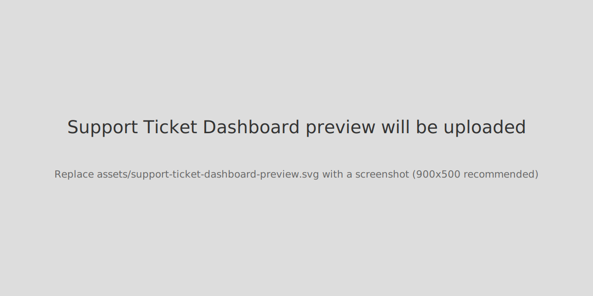

# Data Portfolio – SQL & Tableau Projects

Welcome — I'm **Dave Williams**, a Data Analyst & Visual Storyteller. This repo collects my SQL projects, Tableau dashboards, and annotated case studies that show how I clean data, build insight, and tell a visual story.

  

---

## Quick preview
<!-- Replace these with real screenshots saved under /assets. Naming convention: assets/<project-slug>-preview.svg/png -->

---

## Table of contents
- [About](#about)
- [Highlights & Skills](#highlights--skills)
- [Project index](#project-index)
- [How to view locally](#how-to-view-locally)
- [Display & accessibility tips (for README)](#display--accessibility-tips-for-readme)
- [Per-project READMEs](#per-project-readmes)
- [Contact](#contact)
- [License](#license)

---

## About
I focus on turning messy data into clear, actionable visual stories. Projects in this repo demonstrate:
- pragmatic SQL for cleaning, joining, and aggregating
- dashboarding best practices in Tableau
- annotated case studies that explain decisions and trade-offs

---

## Highlights & skills
- SQL: cleaning, joins, aggregation, window functions, revenue calculations  
- Tableau: dashboards, storytelling sheets, actions, parameterized exploration  
- R: ggplot2 for small survey analysis (IPL fan survey)  
- Documentation: modular case studies with annotated visuals and teaching takeaways

---

## Project index
Each project folder contains: a short case study (README), SQL scripts or workbook files, and exported screenshots/gifs.
| Project | Tools | Highlights |
|---------|-------|------------|
| [Support Ticket Analysis](sql-projects/support-ticket-analysis) | SQL, Tableau | Data cleaning, joins, aggregation, dashboard |
| [Hotel Operations Analysis](sql-projects/hotel-operations-analysis) | SQL | Filtering, joins, operational insights |
| [Grocery Sales Analysis](sql-projects/grocery-sales-analysis) | SQL | Cleaning, filtering, aggregation |
| [Motorcycle Sales Analysis](sql-projects/motorcycle-sales-analysis) | SQL | Net revenue calculation |
| [Fan Engagement Case Study](sql-projects/fan-engagement-case-study) | SQL | Joins, filtering, aggregation |
| [Customer Churn Analysis](tableau-projects/customer-churn-analysis) | Tableau | Storytelling dashboard with churn drivers |
| [Support Ticket Dashboard](tableau-projects/support-ticket-dashboard) | Tableau | Interactive dashboard |
| [Beauty Industry Sales Analysis](tableau-projects/beauty-industry-sales-analysis) | Tableau | Sales trends visualization |
| [IPL Survey Data Analysis](r-programming/ipl-survey-data-analysis) |R programming | Data visualisation,data mining,data wrangling |

---

## How to view locally
1. Clone the repo:
   git clone https://github.com/Swishk261/Dave-s-Portfolio.git
2. Browse project folders:
   - SQL scripts are in sql-projects/
   - Tableau workbooks and exported images are in tableau-projects/
3. For Tableau workbooks (.twbx/.twb) open them with Tableau Desktop / Tableau Public.
4. For quick previews, open the images in the assets/ folder or view the project README files.

Tip: add an assets/ directory and include small PNG or GIF previews of each dashboard so visitors get immediate visual context.

---

## Per-project READMEs
Each project has a small README template in its folder (or a template under /templates). These include: Purpose → Key questions → What I did → Key SQL snippets/visuals → Takeaways → Link to Tableau Public (if published).

---

## Display & accessibility tips for this README
To improve display and make the README more approachable:
- Add small preview images or short gifs for each major dashboard (store under assets/ and reference them with alt text).
- Use badges for tools, live demos, and status to give an immediate signal of project types.
- Include a short "How to open" section for every Tableau project (file type and whether it runs in Tableau Public).
- Keep each project folder's README focused: Purpose → Key questions → What I did → Key SQL snippets/visuals → Takeaways.
- Use consistent link formatting (use full https:// links so badges and previews render reliably).
- Add alt text for all images and provide textual summaries of visuals for accessibility.
- If you publish dashboards on Tableau Public, add direct links to each project's public page.

Quick examples to increase visual polish:
- Small hero banner with your role and one-sentence value proposition.
- One-line badges row (Tableau, SQL, Last commit).
- Use "Try it" buttons/links to Tableau Public or exported interactive HTML (if available).

---

## Contact
- Tableau Public: https://public.tableau.com/
- LinkedIn: https://www.linkedin.com/in/dave-williams-209a23252
- GitHub: https://github.com/Swishk261

---

## License
This portfolio is available under the MIT license. See LICENSE for details.
