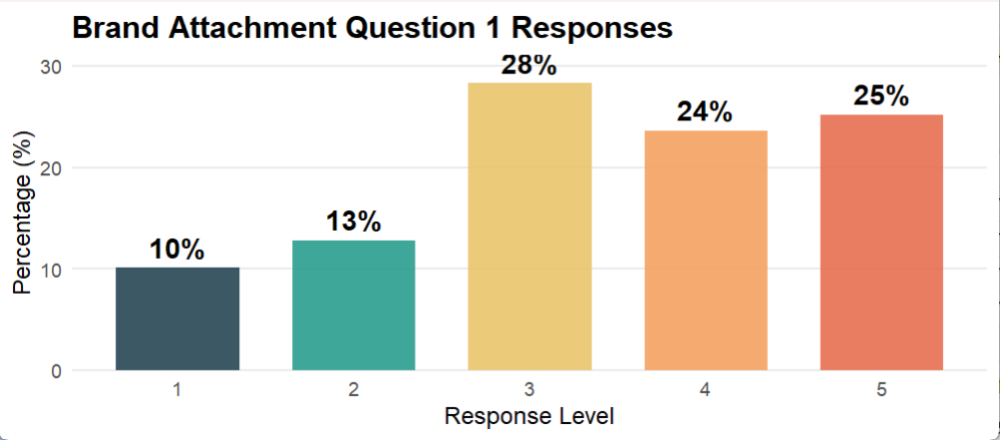
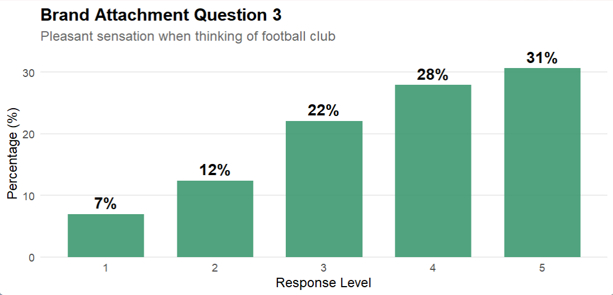
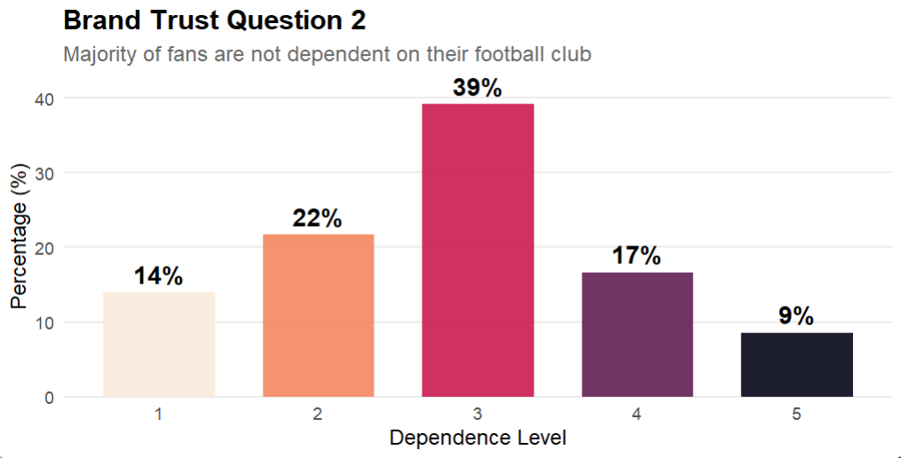
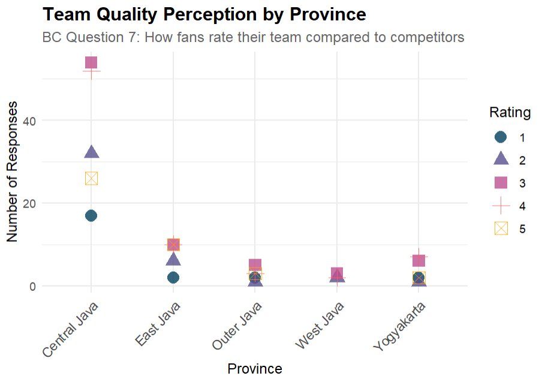
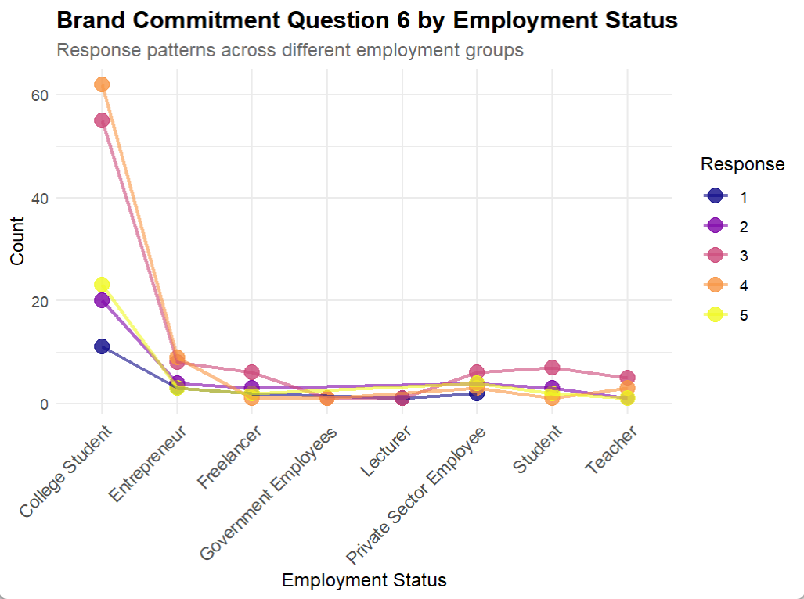

# IPL Fan Survey Analysis (R Programming & Data Visualization)

## 📌 Context
The Indian Premier League (IPL) attracts millions of fans each season, making it one of the most followed sporting events globally. This project analyzes survey data collected from IPL fans to uncover insights into their preferences, engagement patterns, and behavioral tendencies using R programming and visualization libraries.

## 🛠️ Techniques Used
- R Programming: Data cleaning, transformation, aggregation
- Data Visualization in R: ggplot2, dplyr, and other tidyverse tools
- Exploratory Analysis: Fan demographics, engagement drivers, attendance trends

## 📊 Process
1. Data Cleaning
   - Removed duplicate survey responses
   - Standardized team names and categorical variables

2. Transformation
   - Used dplyr for filtering and grouping
   - Created derived variables (e.g., engagement score, attendance frequency)

3. Aggregation
   - Summarized fan preferences by age group, location, and favorite team
   - Calculated average attendance and merchandise purchases per segment

4. Visualization
   - Built bar charts, scatter plots, and heatmaps with ggplot2
   - Highlighted fan demographics, engagement drivers, and attendance trends

---

## 📈 Results
- Demographics: Majority of fans were aged 18–34, with strong urban representation  
- Engagement Drivers: Social media activity and team loyalty were the strongest predictors of fan engagement  
- Attendance Insights: Fans of top-performing teams attended more matches; ticket pricing impacted younger fans significantly  

---

## 🎯 Teaching Takeaway
This case study demonstrates how R programming and visualisation can transform raw survey data into actionable insights for sports marketing, ticket pricing, and fan engagement strategies.

---

## 📷 Visuals

<!-- All assets starting with "R" from /assets, using correct relative paths from this README location -->

*Distribution of responses for BA1 (Brand Attachment – Question 1)*

*Distribution of responses for BA3 (Brand Attachment – Question 3)*

*Distribution of responses for BT2 (Brand Trust – Question 2)*

*Team quality perception by province for BC7 (Brand Commitment – Question 7)*

*Overall brand satisfaction visual*

*Distribution of responses for BS6 (Brand Satisfaction – Question 6)*

---

## 🔗 Links
- R Script: [ipl_fan_survey_analysis.R](ipl_fan_survey_analysis.R)